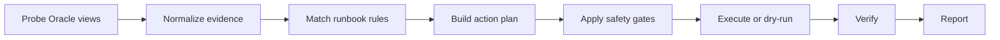

# Architecture

## Control Loop

## Harness Engineering Model

The agent is designed so production and test runs use the same logic after the database access boundary.

- `OracleClient` reads live Oracle views and executes SQL or PL/SQL.
- `FakeOracleClient` reads scenario fixtures and records simulated execution.
- Probes produce `CheckResult` objects.
- Runbooks produce `ActionPlan` objects.
- The executor applies dry-run, approval, and capability gates.
- Reports are JSON serializable so CI, dashboards, or incident tools can consume them.

## Safety Principles

- Dry-run is the default.
- Risky actions are disabled by explicit capability flags.
- Destructive actions require both capability and approval settings.
- Actions are capped by `max_actions_per_run`.
- Each action carries a reason, SQL text, risk level, and verification query where practical.
- Manual actions are allowed when automation would be operationally unsafe.

## Production Rollout

1. Run all included harness scenarios.
2. Add fixtures that mirror your actual database incidents.
3. Run live mode with `dry_run: true`.
4. Review generated action plans with the DBA team.
5. Enable one low-risk action family at a time.
6. Keep higher-risk actions gated by approval or manual execution.
7. Send reports into your incident or observability system.
