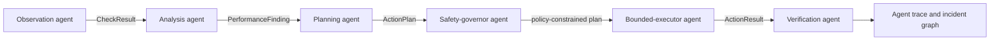
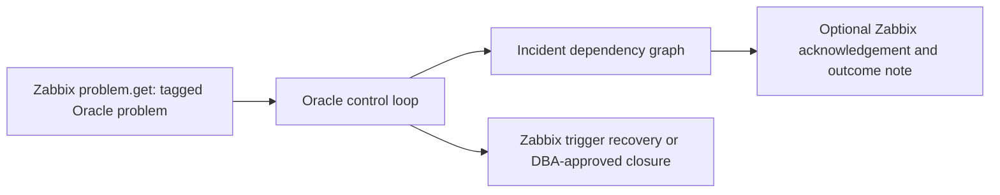

# Architecture

## Agentic Control Plane

`SelfHealingAgent` remains the public façade. Internally,
`AgenticControlPlane` owns the sequence and shares typed state rather than free
text. Each role has one authority boundary:

| Agent | Can do | Cannot do |
| --- | --- | --- |
| Observation | Query approved Oracle views through registered probes | Execute remediation SQL |
| Analysis | Produce advisory performance findings | Apply tuning changes |
| Planning | Select registered runbook plans | Invent or execute arbitrary SQL |
| Safety governor | Describe and enforce configured policy boundaries | Open a disabled capability |
| Bounded executor | Execute registered plans after hard gates | Bypass approval, capability, or dry-run policy |
| Verification | Assess recorded outcomes and verification-query results | Declare Zabbix recovery without trigger evidence |

### Model boundary

No LLM is required for the current control plane. If one is added later, it may
operate only as a schema-constrained advisor behind the analysis or planning
role. Its output must resolve to registered runbooks and pass the deterministic
safety governor. Credentials and database/Zabbix write tools remain outside the
model boundary.

## Zabbix Incident Boundary

Zabbix is the incident intake and operator-facing status surface. Oracle is the
remediation target. The bridge never treats a completed SQL call as permission
to close a Zabbix problem; Zabbix trigger recovery is the default resolution
signal. This keeps monitoring truth separate from automation intent.

## Harness Engineering Model

The agent is designed so production and test runs use the same agentic logic after the database access boundary.

- `OracleClient` reads live Oracle views and executes SQL or PL/SQL.
- `FakeOracleClient` reads scenario fixtures and records simulated execution.
- Probes produce `CheckResult` objects.
- `PerformanceExpertEngineer` produces advisory `PerformanceFinding` objects.
- Runbooks produce `ActionPlan` objects.
- The executor applies dry-run, approval, and capability gates.
- `AgentStep` entries form the ordered, audit-friendly hand-off trace.
- Reports are JSON serializable so CI, dashboards, or incident tools can consume them.
- The incident dependency graph links checks to findings and plans, then plans to their actual gated, dry-run, manual, failed, or executed outcome. It documents control-flow provenance rather than inferring a root cause.

## Performance Expert Engineer

Performance engineering is separated from automatic healing. The advisor can identify high-load SQL, dominant waits, and optimizer-statistics risk, but it emits recommendations instead of unsafe automatic tuning changes.

This keeps the system useful during incidents without letting it make broad workload changes such as creating indexes, changing SQL plans, or rewriting application SQL without review.

## Safety Principles

- Dry-run is the default.
- Risky actions are disabled by explicit capability flags.
- Destructive actions require both capability and approval settings.
- Actions are capped by `max_actions_per_run`.
- Each action carries a reason, SQL text, risk level, and verification query where practical.
- Manual actions are allowed when automation would be operationally unsafe.

## Production Rollout

1. Run all included harness scenarios.
2. Add fixtures that mirror your actual database incidents.
3. Run live mode with `dry_run: true`.
4. Review generated action plans with the DBA team.
5. Enable one low-risk action family at a time.
6. Keep higher-risk actions gated by approval or manual execution.
7. Send reports into your incident or observability system.
